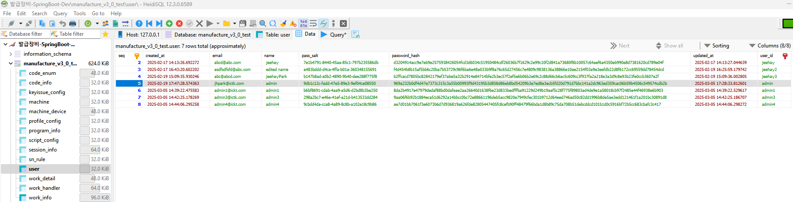

###### <div style="text-align: right;">📅 문서 업데이트: 2025-03-11</div>

<br><br><br>

# 📌 배포 및 설정 과정

- 😅 이 프로젝트는 AWS EC2 인스턴스를 사용하여 배포 테스트 했습니다. (이 내용은 슬랙에도 공유했었습니다. 2024-11-01) 개인 계정으로 AWS Free-Tier EC2 인스턴스를 생성하여 배포 테스트했습니다. (free-tier 계정으로 개인적으로 여러 테스트를 진행하니 과금이 발생해 인스턴스를 종료하였습니다.)

- Spring Boot + TypeScript Application 배포 (AWS EC2, Self-Signed Certificate, MariaDB)
- AWS EC2 인스턴스에 배포. MariaDB를 데이터베이스로 사용하고, 자체 서명된 SSL 인증서를 설정하여 보안을 강화

<br><br>

### Spring Boot + TypeScript Application 배포 (AWS EC2, Self-Signed Certificate, MariaDB)

- AWS EC2 인스턴스 배포:
  - AWS Free-tier EC2 인스턴스를 생성하여 Spring Boot 애플리케이션과 TypeScript 애플리케이션을 배포.
  - Spring Boot 애플리케이션은 별도의 Java 환경 설정 없이 EC2에서 실행.
  - TypeScript 애플리케이션은 Nginx 서버를 통해 EC2에서 서빙.

<br><br>

- Nginx 설정:
  - TypeScript 애플리케이션을 EC2에서 서빙할 때 Nginx를 사용.
  - Nginx는 프론트엔드와 백엔드 간의 API 요청을 처리하고, HTTPS로의 리디렉션 및 로드 밸런싱을 지원.
  - 포트 설정: Nginx가 80번 포트(HTTP)와 443번 포트(HTTPS)에서 요청을 받아 적절히 처리하도록 설정.

<br><br>

- Spring Boot 애플리케이션 배포:
  - Spring Boot 애플리케이션은 EC2 인스턴스 내에서 실행.
  - Spring Boot 애플리케이션의 API는 TypeScript 애플리케이션과 통신하기 위해 적절히 설정됨.

<br><br>

- MariaDB 설정:

  - AWS EC2에 MariaDB를 설치하고 Spring Boot 애플리케이션과 연결할 수 있도록 JDBC URL 및 인증 정보를 설정.

  - user 테이블에 최소한의 사용자 정보를 넣어야 로그인 테스트를 진행할 수 있습니다. 사용자 데이터는 직접 삽입해야 하며, password_hash 값을 생성하여 넣어야 합니다.

  - `user` 테이블 예시:

  ```json
  {
    "table": "user",
    "rows": [
      {
        "seq": 5,
        "created_at": "2025-02-19 17:47:28.574363",
        "email": "jhpark@ictk.com",
        "name": "admin",
        "pass_salt": "9db1c12c-fadd-47e5-89e3-9ef04ce08550",
        "password_hash": "969a232b0df4d47e7373c315c3a55b00993f9d43195b3d858d86eb8bd54209b3e7ed8e3ecb5fd20d791d7bbc141a2dc963ed359cac06b59b4506c549574cdb2b",
        "updated_at": "2025-03-05 17:28:33.812601",
        "user_id": "admin"
      }
    ]
  }
  ```

    <br><br>

  - 사용자 데이터 삽입:

    - Spring Boot 애플리케이션이 실행될 때 자동으로 테이블이 생성되지만, 데이터는 비어 있으므로 'admin' 사용자 데이터를 직접 추가해야 로그인 테스트가 가능합니다.

    <br>

  - `password_hash` 값을 생성하는 방법: -`C:\tasks\passwordHashGenerator\passwordHashGenerator.js` 파일을 사용하면 편리하게 `password_hash` 값을 생성할 수 있습니다.

    

<br><br>

- Self-Signed Certificate 설정:
  - OpenSSL 등을 이용하여 자체 서명된 SSL 인증서를 생성.
  - Spring Boot와 Nginx 서버에서 HTTPS를 적용하여 데이터를 암호화하여 통신.

<br><br>

- AWS EC2 보안 그룹 설정:
  - EC2 인스턴스의 보안 그룹에서 필요한 포트(HTTP/HTTPS, MariaDB 등)를 열어 외부 접근을 허용.

<br><br><br>

## 프론트엔드 프로젝트 실행 (개발 모드 로컬 환경)

### 1. Git 저장소 복사

```sh
    git clone https://github.com/jeehay-park/issuance-machine-frontend.git

    cd issuance-machine-frontend
```

<br>

### 2. 패키지 설치 및 실행

- 💡 로컬 환경에서 실행 시 `.env`의 URL 은 다음과 같은 경로를 사용해야합니다.

  ```sh
      # 💻 To start the React app locally
      REACT_APP_API_URL=http://localhost:17777/ictk/issue/admin
  ```

<br>

- 의존성 설치 및 실행

  ```sh
      npm install    # 최초 실행 시
      npm run start  # 로컬 환경에서 실행
  ```

<br><br><br>

## 프로젝트 빌드 방법

-💡 빌드 실행 시, `.env`의 URL은 다음과 같은 경로를 사용해야 합니다.

    ```sh
        REACT_APP_API_URL=https://43.203.250.0/ictk/issue/admin
        // AWS ec2로 배포
    ```

<br>

### 1. 명령어 실행

- 사용 예시
  ```sh
      npm run build
  ```
