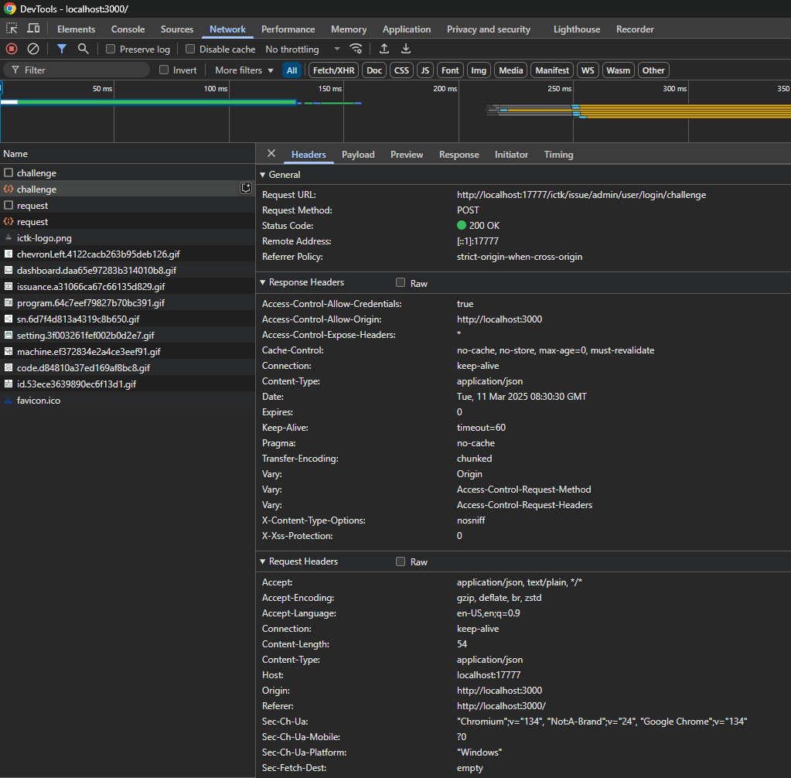
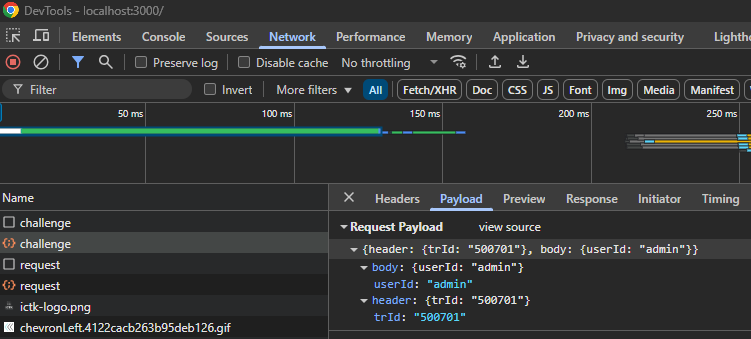
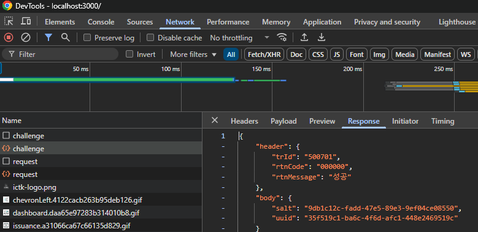

###### <div style="text-align: right;">📅 문서 업데이트: 2025-03-11</div>

<br><br>

## 📌 디버깅 도구

### **1. Chrome DevTools**  
   **Chrome DevTools**는 웹 페이지를 디버깅하고 성능을 분석할 수 있는 브라우저 도구입니다. 이를 사용하여 API 호출 내역을 확인하거나, 코드 실행 상태를 추적할 수 있습니다.

<br>

   **DevTools를 여는 방법**:

   - **단축키**: `Ctrl + Shift + I` (Windows)
   - **메뉴에서 열기**: 브라우저에서 우클릭 후, "검사" 또는 "Inspect"를 선택하여 DevTools를 열 수 있습니다.

<br>

   **API 호출 내역 확인하기**:

   1. **DevTools**가 열리면, 상단 메뉴에서 **Network** 탭을 클릭합니다.

   2. 페이지를 새로 고침하거나 API 호출을 실행합니다. 그러면 **Network** 탭에서 모든 네트워크 요청이 나타납니다.

   3. 요청을 클릭하여 요청/응답 내용과 상태 코드 등을 자세히 확인할 수 있습니다.

   

   <br>

   

   <br>

   
   
<br>

   **Console 탭**:

   - **Console** 탭에서는 `console.log`로 출력된 로그를 실시간으로 확인할 수 있습니다. 이를 통해 코드의 흐름이나 변수 값을 추적할 수 있습니다.


<br><br><br>

### **2. `console.log` 활용**
   - 코드 안에 `console.log`를 추가하여 변수를 출력하거나, 특정 코드 블록의 실행 여부를 확인할 수 있습니다.
     - **유용한 로그 출력 예시**:
       ```javascript
       console.log("API 호출 전:", requestData);
       console.log("API 응답:", responseData);
       ```

